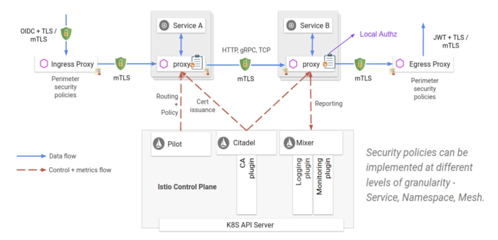

## Istio

- [Service Mesh](# Service-Mesh)

- [Istio](# Istio)
- [Istio 기능](# Istio-기능)
- [Istio 구조](# Istio-구조)
- [Istio 환경셋팅](# Istio-환경셋팅)
- [모니터링 툴 설치](# 모니터링-툴-설치)
- [Auto Sidecar Injection](# Auto-Sidecar-Injection)
- [IngressGateway 설정](# IngressGateway-설정)
- [Circuit Breaker](# Circuit-Breaker)


### Service Mesh

- 서비스 간의 통신을 제어하고 관리할 수 있도록 하는데 특화된 마이크로 서비스를 위한 계층
- 실제 서비스 옆에 프록시 서버가 사이드카 패턴 형태로 배치되어 타 서비스와 직접 호출이 아닌 프록시 서버를 통해 호출하는 형태
- 


### Istio

- Istio는 오픈소스 서비스 메쉬 플랫폼
- 서비스 코드를 변경할 필요 없이 서비스 간 트래픽 흐름을 관리하고 액세스 정책을 적용하며 원격 분석 데이터를 집계함


### Istio 기능

- 서비스 간의 트래픽 및 API 호출 흐름을 제어
- TLS 암호화, 서비스 간 인증 및 권한 부여를 통해 서비스를 안전하게 보호
- 모든 서비스의 자동 추적, 모니터링 등으로 상황 확인


### Istio 구조

- Data Plane
  - 프록시 서버들로 이루어져 있으며 Config에 따라 트래픽을 컨트롤 하는 부분
  - 서비스 옆에 Envoy Proxy를 붙여 사이드카 형식으로 배포함
  - 서비스 트래픽을 프록시 서버를 통해서 통제함
- Control Plane
  - Pilot: Envoy에 대한 설정 관리, 서비스 호출 관련 기능 제공 등
  - Mixer: 액세스 컨트롤, 정책 통제, 모니터링 데이터 수집 등
  - Citadel: 사용자 인증 및 인가, TLS 암호화 등
  - 서비스들에 대한 엔드포인트 정보는 컨트롤 플레인의 Pilot에 저장되어 있고, Envoy는 이를 참고하여 엔드포인트를 알 수 있다. (Service Discovery)
- VirtualService
  - 서비스 메시의 라우팅 규칙을 정의함.
  - Destination weight 스펙을 통해 라우팅되는 비율을 정할 수 있음.
- DestinationRule
  - VirtualService에 의해 특정 서비스로 라우팅 발생 이후 트래픽에 대한 정책, 규칙을 정의함.
  - subset을 구성하여 요청에 대한 destination을 정의할 수 있음.
- IngressGateway
  - 서비스 메시로 들어오는 트래픽 처리
- 


### Istio 환경셋팅

- Istio 설치

  - ```sh
    $ curl -L https://istio.io/downloadIstio | ISTIO_VERSION=1.11.3 TARGET_ARCH=x86_64 sh -
    $ cd istio-1.11.3
    $ export PATH=$PWD/bin:$PATH
    ```

- Profile 설치

  - Profile 통해 Istio 구성(Control Plane, Data Plane)을 custom할 수 있음.

  - [istio profile](https://istio.io/latest/docs/setup/additional-setup/config-profiles/)

  - ```sh
    $ istioctl profile list
    Istio configuration profiles:
        default
        demo
        empty
        external
        minimal
        openshift
        preview
        remote
    ```

  - ```sh
    $ istioctl install --set profile=default --set hub=gcr.io/istio-release
    This will install the Istio 1.11.3 default profile with 
    ["Istio core" "Istiod" "Ingress gateways"] 
    components into the cluster. Proceed? (y/N) y
    ```


### 모니터링 툴 설치

```sh
$ kubectl apply -f istio-1.11.3/samples/addons

$ kubectl get namespace
NAME              STATUS   AGE
default           Active   3h6m
istio-system      Active   5m24s
kube-node-lease   Active   3h6m
kube-public       Active   3h6m
kube-system       Active   3h6m

$ kubectl get svc -n istio-system
NAME                           TYPE           CLUSTER-IP       EXTERNAL-IP                                                                   PORT(S)                                                                      AGE
service/grafana                ClusterIP      10.xx.xx.xx     <none>                                                                        3000/TCP                                                                     2m19s
service/istio-ingressgateway   LoadBalancer   10.xx.xx.xx   xxx.ap-southeast-2.elb.amazonaws.com   15021:31538/TCP,80:31935/TCP,443:30293/TCP,31400:30433/TCP,15443:30098/TCP   5m19s
service/istiod                 ClusterIP      10.xx.xx.xx    <none>                                                                        15010/TCP,15012/TCP,443/TCP,15014/TCP                                        5m31s
service/jaeger-collector       ClusterIP      10.xx.xx.xx    <none>                                                                        14268/TCP,14250/TCP,9411/TCP                                                 2m15s
service/kiali                  ClusterIP      10.xx.xx.xx     <none>                                                                        20001/TCP,9090/TCP                                                           2m12s
service/prometheus             ClusterIP      10.xx.xx.xx   <none>                                                                        9090/TCP                                                                     2m10s
service/tracing                ClusterIP      10.xx.xx.xx    <none>                                                                        80/TCP,16685/TCP                                                             2m16s
service/zipkin                 ClusterIP      10.xx.xx.xx    <none>                                                                        9411/TCP                                                                     2m16s
```

- 외부에서 접속이 가능하도록 Kiali, Zipkin, Grafana를 LoadBalancer로 변경

  - ```sh
    $ kubectl edit svc kiali -n istio-system
    :%s/ClusterIP/LoadBalancer/g
    :wq!
    service/kiali edited
    
    $ kubectl edit svc zipkin -n istio-system
    :%s/ClusterIP/LoadBalancer/g
    :wq!
    service/zipkin edited
    
    $ kubectl edit svc grafana -n istio-system
    :%s/ClusterIP/LoadBalancer/g
    :wq!
    service/grafana edited
    ```

- 모든 요청시 분산추적이 가능하도록 rating을 100으로 설정. (개발 단계에서만..)

  - [customizing trace sampling](https://istio.io/latest/docs/tasks/observability/distributed-tracing/mesh-and-proxy-config/#customizing-trace-sampling)

  - ```yml
    apiVersion: install.istio.io/v1alpha1
    kind: IstioOperator
    metadata:
      name: zipkin
      namespace: istio-system
    spec:
      meshConfig:
        enableTracing: true
        defaultConfig:
          tracing:
            sampling: 100   # 모든 요청을 추적
    ```


### Auto Sidecar Injection

- pod 안에 proxy container를 삽입하는 것을 sidecar injection이라고 한다.

- 자동으로 inject 할 수 있는 이유는 ``mutatingwebhookconfiguration`` 에 설정되어 있기 때문이다.

- ``kubectl label namespace <namespace> istio-injection=enabled`` 자동으로 inject 하는 명령어다.

- ```sh
  $ kubectl label namespace {namespace 명} istio-injection=enabled
  ```


### IngressGateway 설정

- Gateway: 트래픽 받을 호스트명과, 포트, 프로토콜을 정의한다.

- VirtualService: URI 기반으로 서비스 라우팅

- Kubernetes Ingress는 Istio Control Plane에서 관리할 수 없다고 함. 이러다 보니 Service Mesh 작업이 복잡해졌으며 이를 해결하기 위해 Istio Gateway가 나옴.

- ```yml
  apiVersion: networking.istio.io/v1alpha3
  kind: Gateway
  metadata:
    name: {{ .Values.env.gatewayName }}
    namespace: {{ .Values.namespace }}
  spec:
    selector:
      istio: ingressgateway # use istio default controller
    servers:
      - port:
          number: {{ .Values.service.port }}
          name: http
          protocol: HTTP
        hosts:
          - "*"
  ---
  apiVersion: networking.istio.io/v1alpha3
  kind: VirtualService
  metadata:
    name: {{ .Values.env.gatewayName }}
    namespace: {{ .Values.namespace }}
  spec:
    hosts:
      - "*"
    gateways:
      - {{ .Values.env.gatewayName }}
    http:
      - match:
          - uri:
              prefix: /api
        route:
          - destination:
              host: {{ .Values.istioIngress.gateway.host }}
              port:
                number: {{ .Values.istioIngress.gateway.port }}
      - route:
          - destination:
              host: {{ .Values.istioIngress.front.host }}
              port:
                number: {{ .Values.istioIngress.front.port }}
  ```


### Circuit Breaker

- DestinationRule 사용하여 적용

```yml
{{- if .Values.circuit.enabled }}
apiVersion: networking.istio.io/v1alpha3
kind: DestinationRule
metadata:
  name: {{ include "accusation.fullname" . }}
  namespace: {{ .Values.namespace }}
spec:
  host: {{ include "accusation.fullname" . }}
  trafficPolicy:
    connectionPool:
      tcp:
        maxConnections: {{ .Values.circuit.tcp.connection }}	# 연결 가능한 최대 수
      http:
        http1MaxPendingRequests: {{ .Values.circuit.http.maxPending }}	# 요청 보류에 대한 최대 수
        maxRequestsPerConnection: {{ .Values.circuit.http.connection }}	# 연결 가능한 최대 수
    outlierDetection:
      interval: {{ .Values.circuit.interval }}	# 분석 기간
      consecutive5xxErrors: {{ .Values.circuit.consecutive5xxErrors }}	# 연속 에러 수
      baseEjectionTime: {{ .Values.circuit.baseEjectionTime }}	# 3분 동안 제외
      maxEjectionPercent: {{ .Values.circuit.maxEjectionPercent }}	# 모든 인스턴스 수 제거
{{- end }}
```


참고

- [Service mesh에 적합한 Ingress Gateway는 무엇일까?](https://binux.tistory.com/63)

- [서비스 메시](https://daddyprogrammer.org/post/13700/service-mesh/)
- [istio 공식문서](https://istio.io/latest/docs/)

