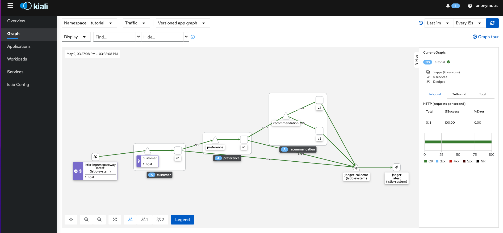
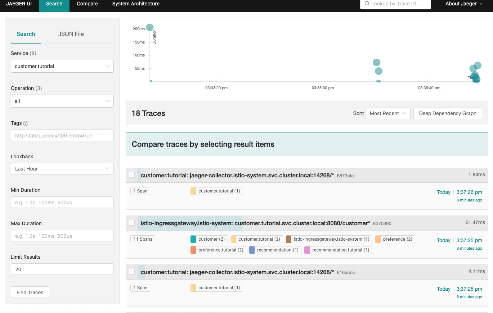
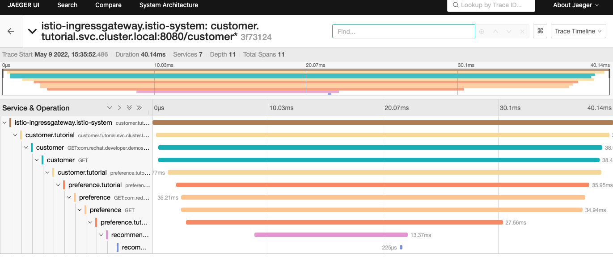

## Istio Tutorial

- [Tutorial](https://github.com/redhat-scholars/istio-tutorial) 진행한 내용 정리


### Setup

```sh
$ git clone https://github.com/redhat-developer-demos/istio-tutorial
Cloning into 'istio-tutorial'...

$ kubectl create namespace tutorial
$ kubectl label namespace tutorial istio-injection=enabled
```


### Customer 서비스 배포

- [Deployment.yml](https://github.com/redhat-scholars/istio-tutorial/blob/master/customer/kubernetes/Deployment.yml)
- [Service.yml](https://github.com/redhat-scholars/istio-tutorial/blob/master/customer/kubernetes/Service.yml)

```sh
$ kubectl apply -f <(istioctl kube-inject -f customer/kubernetes/Deployment.yml) -n tutorial
serviceaccount/customer created
deployment.apps/customer created

$ kubectl describe pod/customer-7894f979bb-ktl8v -n tutorial
Events:
  Type    Reason     Age   From                                       Message
  ----    ------     ----  ----                                       -------
  Normal  Pulled     34s   kubelet, Container image "gcr.io/istio-release/proxyv2:1.11.3" already present on machine
  Normal  Created    34s   kubelet, Created container istio-init
  Normal  Started    33s   kubelet, Started container istio-init
  
$ kubectl apply -f customer/kubernetes/Service.yml -n tutorial
service/customer created

$ kubectl get all -n tutorial
NAME                            READY   STATUS    RESTARTS   AGE
pod/customer-7894f979bb-gf99c   2/2     Running   0          4m20s

NAME               TYPE        CLUSTER-IP      EXTERNAL-IP   PORT(S)    AGE
service/customer   ClusterIP   10.xx.xx.xx   <none>        8080/TCP   15s

NAME                       READY   UP-TO-DATE   AVAILABLE   AGE
deployment.apps/customer   1/1     1            1           4m21s

NAME                                  DESIRED   CURRENT   READY   AGE
replicaset.apps/customer-7894f979bb   1         1         1       4m21s
```


### Istio Gateway 설정

- [Istio Gateway.yml](https://github.com/redhat-scholars/istio-tutorial/blob/master/customer/kubernetes/Gateway.yml)
- URI path가 "/customer"로 시작하면 customer 서비스로 라우팅
- customer 서비스 호출 URI: http://(istio-ingressgateway EXTERNAL-IP)/customer

```Sh
$ kubectl apply -f customer/kubernetes/Gateway.yml -n tutorial
gateway.networking.istio.io/customer-gateway created
virtualservice.networking.istio.io/customer-gateway created
```

 

### Preference, Recommendation-v1, Recommendation-v2 서비스 배포

- Preference
  - [Deployment.yml](https://github.com/redhat-scholars/istio-tutorial/blob/master/preference/kubernetes/Deployment.yml)
  - [Service.yml](https://github.com/redhat-scholars/istio-tutorial/blob/master/preference/kubernetes/Service.yml)
- Recommendation-v1
  - [Deployment.yml](https://github.com/redhat-scholars/istio-tutorial/blob/master/recommendation/kubernetes/Deployment.yml)
  - [Service.yml](https://github.com/redhat-scholars/istio-tutorial/blob/master/recommendation/kubernetes/Service.yml)

- Recommendation-v2
  - [Deployment.yml](https://github.com/redhat-scholars/istio-tutorial/blob/master/recommendation/kubernetes/Deployment-v2.yml)

```sh
$ kubectl apply -f preference/kubernetes/Deployment.yml -n tutorial
serviceaccount/preference created
deployment.apps/preference-v1 created

$ kubectl create -f preference/kubernetes/Service.yml -n tutorial
service/preference created

$ kubectl apply -f recommendation/kubernetes/Deployment.yml -n tutorial
serviceaccount/recommendation created
deployment.apps/recommendation-v1 created

$ kubectl create -f recommendation/kubernetes/Service.yml -n tutorial
service/recommendation created

$ kubectl apply -f recommendation/kubernetes/Deployment-v2.yml -n tutorial
deployment.apps/recommendation-v2 created
```


### Kiali, Jaeger 모니터링

- customer 호출 후 Kigali, Jaeger 통해 트래픽 흐름을 확인.








### Recommendation-v2 서비스로 100% 라우팅

- [destination-rule-recommendation-v1-v2.yml](https://github.com/redhat-scholars/istio-tutorial/blob/master/istiofiles/destination-rule-recommendation-v1-v2.yml)
- [virtual-service-recommendation-v2.yml](https://github.com/redhat-scholars/istio-tutorial/blob/master/istiofiles/virtual-service-recommendation-v2.yml)

```yml
kind: VirtualService
metadata:
  name: recommendation
spec:
  hosts:
  - recommendation
  http:
  # version-v2 weight를 100으로 설정하여 100% 라우팅 설정한다.
  - route:
    - destination:
        host: recommendation
        subset: version-v2
      weight: 100
```

```sh
$ kubectl apply -f istiofiles/destinat-rule-recommendation-v1-v2.yml -n tutorial
destinationrule.networking.istio.io/recommendation created

$ kubectl apply -f istiofiles/virtual-service-recommendation-v2.yml -n tutorial
virtualservice.networking.istio.io/recommendation created
```


### v1:v2를 90%:10% 비율로 라우팅

- [virtual-service-recommendation-v1_and_v2.yml](https://github.com/redhat-scholars/istio-tutorial/blob/master/istiofiles/virtual-service-recommendation-v1_and_v2.yml)

```yml
http:
- route:
  - destination:
      host: recommendation
      subset: version-v1
    weight: 90
  - destination:
      host: recommendation
      subset: version-v2
    weight: 10
```

```sh
$ kubectl apply -f istiofiles/virtual-service-recommendation-v1_and_v2.yml -n tutorial
```


### Header 기반 라우팅(브라우저 유형별)

- [virtual-service-firefox-recommendation-v2.yml](https://github.com/redhat-scholars/istio-tutorial/blob/master/istiofiles/virtual-service-firefox-recommendation-v2.yml)

```yml
apiVersion: networking.istio.io/v1alpha3
kind: VirtualService
metadata:
  name: recommendation
spec:
  hosts:
  - recommendation
  http:
  - match:
    - headers:
        baggage-user-agent:
          regex: .*Firefox.*
    route:
    # 브라우저가 Firefox 일 경우 v2로 라우팅
    - destination:
        host: recommendation
        subset: version-v2
  - route:
  # 그 외 브라우저는 v1으로 라우팅
    - destination:
        host: recommendation
        subset: version-v1
---
```

```sh
$ kubectl apply -f istiofiles/virtual-service-firefox-recommendation-v2.yml -n tutorial
```


### 라우팅 정책 삭제

```sh
$ kubectl delete dr recommendation -n tutorial
$ kubectl delete vs recommendation -n tutorial
```

